# Graph Algorithms
Many programming problems can be solved by modeling the problem as a graph
problem and using an appropriate graph algorithm. A typical example of a graph
is a network of roads and cities in a country. Sometimes, though, the graph is
hidden in the problem and it may be difficult to detect it. 

## Table of Contents
1. [Graph Terminology](#1-graph-terminology)
    + [Connectivity](#connectivity)
    + [Edge directions](#edge-directions)
    + [Edge weights](#edge-weights)
    + [Neighbors and degrees](#neighbors-and-degrees)
2. [Graph Representation](#2-graph-representation)
    + [Adjacency list representation](#adjacency-list-representation)
3. [Graph Traversal](#3-graph-traversal)
    + [Depth-first search](#depth-first-search)
        - [Example](#example)
        - [Implementation](#implementation)
    + [Breadth-first Search](#breadth-first-search)
        - [Example](#example-1)
        - [Implementation](#implementation-1)
            * [Introduction to queue](#introduction-to-queue)
4. [Practice Questions](#4-practice-questions)

<a id="1-graph-terminology"></a>
<br><br><br><br><br>
# 1. Graph Terminology
A **graph** consists of **nodes** and **edges**.  

For example, the following graph consists of 5 nodes and 7 edges:  
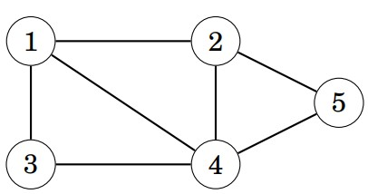

A path leads from node a to node b through edges of the graph. The length
of a path is the number of edges in it. For example, the above graph contains a
path 1 → 3 → 4 → 5 of length 3 from node 1 to node 5:  
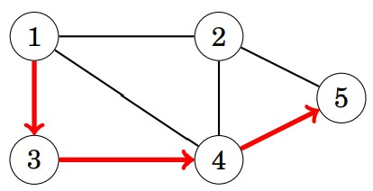

A path is a **cycle** if the first and last node is the same. For example, the above
graph contains a cycle 1 → 3 → 4 → 1.
<a id="connectivity"></a>
<br><br><br><br><br>
## Connectivity
A graph is **connected** if there is a path between any two nodes. For example,
the following graph is connected:  
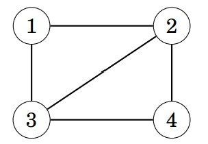

The following graph is not connected, because it is not possible to get from
node 4 to any other node:  
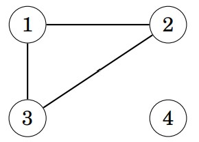

The connected parts of a graph are called its **components**. For example, the
following graph contains three components: {1, 2, 3}, {4, 5, 6, 7} and {8}.  
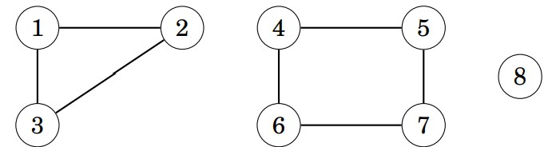

A tree is a connected graph that consists of n nodes and n−1 edges. There is
a unique path between any two nodes of a tree. For example, the following graph
is a tree:  
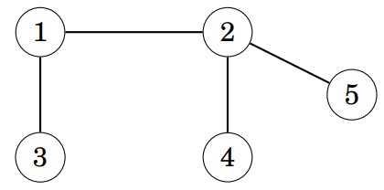
<a id="edge-directions"></a>
<br><br><br><br><br>
## Edge directions
A graph is **directed** if the edges can be traversed in one direction only. For
example, the following graph is directed:  
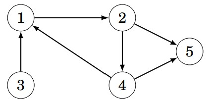

The above graph contains a path 3 → 1 → 2 → 5 from node 3 to node 5, but
there is no path from node 5 to node 3.  
<a id="edge-weights"></a>
<br><br><br><br><br>
## Edge weights
In a **weighted** graph, each edge is assigned a **weight**. The weights are often
interpreted as edge lengths. For example, the following graph is weighted:  
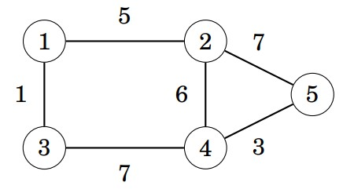

The length of a path in a weighted graph is the sum of the edge weights on
the path. For example, in the above graph, the length of the path 1 → 2 → 5 is 12,
and the length of the path 1 → 3 → 4 → 5 is 11. The latter path is the shortest
path from node 1 to node 5.
<a id="neighbors-and-degrees"></a>
<br><br><br><br><br>
## Neighbors and degrees
Two nodes are **neighbors** or **adjacent** if there is an edge between them. The
**degree** of a node is the number of its neighbors. For example, in the following
graph, the neighbors of node 2 are 1, 4 and 5, so its degree is 3.  
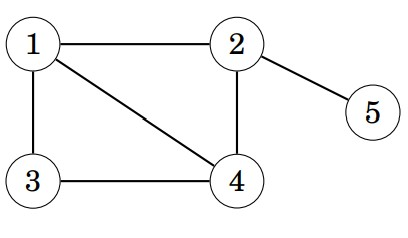
<a id="2-graph-representation"></a>
<br><br><br><br><br>
# 2. Graph Representation
There are several ways to represent graphs in algorithms. The choice of a data
structure depends on the size of the graph and the way the algorithm processes
it.  
<a id="adjacency-list-representation"></a>
<br><br><br><br><br>
## Adjacency list representation
In the adjacency list representation, each node x in the graph is assigned an
**adjacency list** that consists of nodes to which there is an edge from x. Adjacency
lists are the most popular way to represent graphs, and most algorithms can be
efficiently implemented using them.  
A convenient way to store the adjacency lists is to declare an array of vectors
as follows:  
```cppvector<int> adj[N];```
The constant N is chosen so that all adjacency lists can be stored. For example,
the graph  
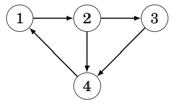  

can be stored as follows:  
```cpp
adj[1].push_back(2);    //meaning node 1 connecting to node 2 in only one dirction
adj[2].push_back(3);
adj[2].push_back(4);
adj[3].push_back(4);
adj[4].push_back(1);
```

If the graph is **undirected**, it can be stored in a similar way, but each edge is
added in both directions.  
For a weighted graph, the structure can be extended as follows:  
```cpp
vector<pair<int,int>> adj[N];   //adj[a] contains pairs (neighbor_node, edge_weight)
```

In this case, the adjacency list of node a contains the pair (b,w) always when
there is an edge from node a to node b with weight w. For example, the graph  
  
can be stored as follows:
```cpp
adj[1].push_back({2,5});    // There is a directed edge from node 1 to node 2 with weight 5 (For an undirected graph, you would also need: adj[2].push_back({1,5});)
adj[2].push_back({3,7});
adj[2].push_back({4,6});
adj[3].push_back({4,5});
adj[4].push_back({1,2});
```

The benefit of using adjacency lists is that we can efficiently find the nodes
to which we can move from a given node through an edge. For example, the
following loop goes through all nodes to which we can move from node s:
```cpp
for (auto u : adj[s]) {     // auto  automatically deduce the defined variable’s type based on the value you assign to it.
    // process node u
}
// or
for (int u = 0; u<adj[s].size(); u++) {
    // process node u
}
```
<a id="3-graph-traversal"></a>
<br><br><br><br><br>
# 3. Graph traversal
Two fundamental graph algorithms are discussed: [Depth First Search](#depth-first-search)(DFS) and [Breadth-First Search](#breadth-first-search)(BFS).
<a id="depth-first-search"></a>
<br><br><br><br><br>
## Depth-First Search
Depth-first search (DFS) is a straightforward graph traversal technique. The
algorithm begins at a starting node, and proceeds to all other nodes that are
reachable from the starting node using the edges of the graph.  
Depth-first search always follows a single path in the graph as long as it
finds new nodes. After this, it returns to previous nodes and begins to explore
other parts of the graph. The algorithm keeps track of visited nodes, so that it
processes each node only once.
<a id="example"></a>
<br><br><br><br><br>
### Example
Consider how depth-first search processes the following graph:  
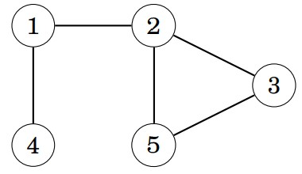  
We may begin the search at any node of the graph; now we will begin the search
at node 1.  
The search first proceeds to node 2:  
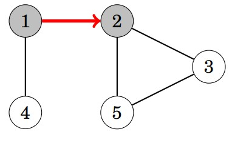  
After this, nodes 3 and 5 will be visited:  
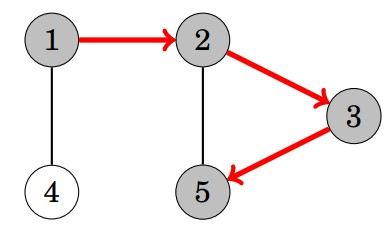  

The neighbors of node 5 are 2 and 3, but the search has already visited both of
them, so it is time to return to the previous nodes. Also the neighbors of nodes 3
and 2 have been visited, so we next move from node 1 to node 4:  
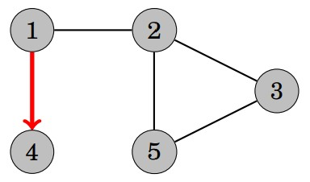

After this, the search terminates because it has visited all nodes.  
The **time complexity** of depth-first search is *O(n + m)* where *n* is the number
of nodes and *m* is the number of edges, because the algorithm processes each
node and edge once.

Here is a [video](https://drive.google.com/file/d/1P78X9kl2Y1XWRtRGNUd2U3oxn-blotHP/view?usp=sharing) demonstration. 
<a id="implementation"></a>
<br><br><br><br><br>

### Implementation
When implementing DFS, we often use a recursive function to visit the vertices and an array to store whether we've seen a vertex before.
```cpp
#include <bits/stdc++.h>
using namespace std;

int n = 6;
vector<vector<int>> adj(n);
vector<bool> visited(n);     
/*
    The vector visited keeps track of all the visited nodes.
    Initially, each array value is false, and when the search arrives at node s, 
    the value of visited[s] becomes true.
*/

void dfs(int current_node) {
	if (visited[current_node]) { return; }
	visited[current_node] = true;

	for (int neighbor : adj[current_node]) { dfs(neighbor); }
}

int main() {
	/*
        Vector adj stores the graph.
        Node 0 connects to node 1, 2 and 4. 
        Node 1 connects to node 3 and  4.
        Node 2 connects to node 5.
	*/
	adj[0] = {1, 2, 4};
	adj[1] = {3, 4};
	adj[2] = {5};

	for (int i = 0; i < n; i++) {
		// iterate over all connected components in the graph.
		if (!visited[i]) { dfs(i); }
	}
}
```
<a id="breadth-first-search"></a>
<br><br><br><br><br>

## Breadth-First Search
Breadth-first search (BFS) visits the nodes in increasing order of their distance
from the starting node. Thus, we can calculate the distance from the starting
node to all other nodes using breadth-first search. However, breadth-first search
is more difficult to implement than depth-first search.  

Breadth-first search goes through the nodes one level after another. First the
search explores the nodes whose distance from the starting node is 1, then the
nodes whose distance is 2, and so on. This process continues until all nodes have
been visited.  
<a id="example-1"></a>
<br><br><br><br><br>

### Example
Let us consider how breadth-first search processes the following graph:  


Suppose that the search begins at node 1. First, we process all nodes that can be
reached from node 1 using a single edge:  
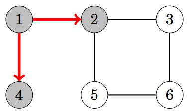

After this, we proceed to nodes 3 and 5:  
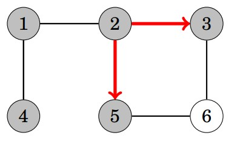

Finally, we visit node 6:  
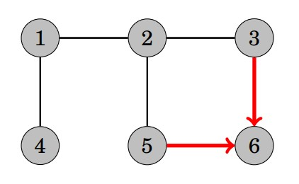

Now we have calculated the distances from the starting node to all nodes of the
graph. The distances are as follows:  
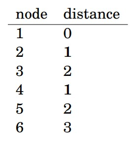

Like in depth-first search, the time complexity of breadth-first search is
*O(n + m)*, where *n* is the number of nodes and *m* is the number of edges.  

Here is a [video](https://drive.google.com/file/d/1O6nI_tjpCIzlq5d8uZCnNaztx6jlGCBl/view?usp=sharing) demonstration.  
<a id="implementation-1"></a>
</a><br><br><br><br><br>

### Implementation
Breadth-first search is more difficult to implement than depth-first search, because the algorithm visits nodes in different parts of the graph. A typical implementation is based on a queue that contains nodes. At each step, the next node in the queue will be processed.  
<a id="introduction-to-queue"></a>
<br><br><br><br><br>

#### Introduction to Queue
A `queue` is a First In First Out (FIFO) data structure that supports three
operations, all in *O(1)* time.    
`push`: inserts at the back of the queue  
`pop`: deletes from the front of the queue  
`front`: retrieves the element at the front without removing it.  

Example:   
```cpp
queue<int> q;               // Define a queue
q.push(1);                  // [1]
q.push(3);                  // [3, 1]
q.push(4);                  // [4, 3, 1]
q.pop();                    // [4, 3]
cout << q.front() << endl;  // 3
```

Here is the implementation of BFS:
```cpp
#include <queue>          // Include queue library 
#include <vector>         
using namespace std;

int main() {
    int n = 6;  // Number of nodes in the graph
    
    // Adjacency list representation of the graph: 
    // adj[i] contains all nodes connected to node i
    vector<vector<int>> adj(n);
    
    // Visited array to keep track of which nodes have been visited
    vector<bool> visited(n);
    
    // Define the edges (graph connections)
    adj[0] = {1, 2, 4};
    adj[1] = {3, 4};
    adj[2] = {5};

    // Loop through all nodes to cover disconnected components
    for (int i = 0; i < n; i++) {
        // If node i has not been visited yet, start BFS from it
        if (!visited[i]) {
            queue<int> q;   
            q.push(i);       
            visited[i] = true;  // Mark the starting node as visited
            
            // Start BFS
            while (!q.empty()) {
                int current_node = q.front(); // Get the node at the front of the queue
                q.pop();                      // Remove it from the queue
                
                // Visit all neighbors of the current node
                for (int neighbor : adj[current_node]) {
                    
                    if (!visited[neighbor]) {       // If neighbor hasn't been visited yet
                        visited[neighbor] = true;  // Mark neighbor as visited
                        q.push(neighbor);          // Enqueue neighbor for further traversal
                    }
                }
            }
        }
    }
}
```
<a id="4-practice-questions"></a>
<br><br><br><br><br>

# 4. Practice Questions
1. [Closing the Farm](http://www.usaco.org/index.php?page=viewproblem2&cpid=644)
2. [Flight Routes Check](https://cses.fi/problemset/task/1682)
3. [Round Dance](https://codeforces.com/contest/1833/problem/E)