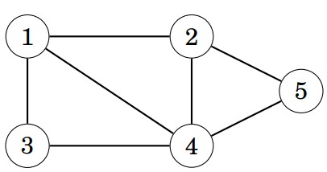
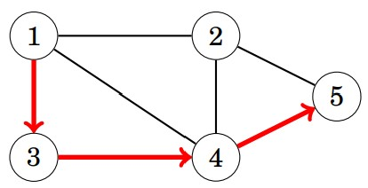
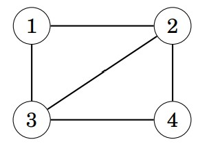
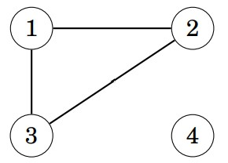
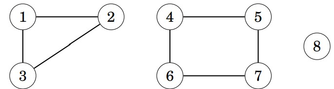
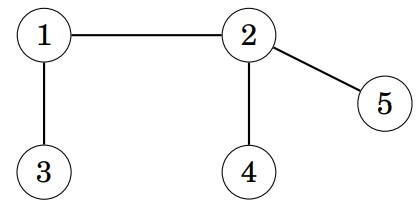
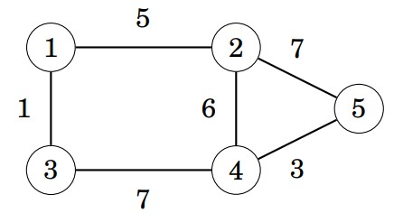
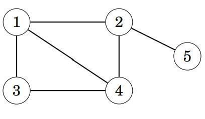
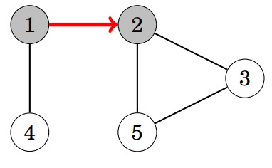
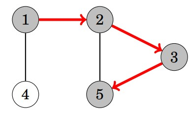

# Graph Algrithms
Many programming problems can be solved by modeling the problem as a graph
problem and using an appropriate graph algorithm. A typical example of a graph
is a network of roads and cities in a country. Sometimes, though, the graph is
hidden in the problem and it may be difficult to detect it. 

## Table of Contents
1. [Graph Terminology](#1-graph-terminology)
2. [Graph Representation](#2-graph-representation)
3. [Graph Traversal](#3-graph-traversal)

# 1. Graph Terminology
A **graph** consists of **nodes** and **edges**.  

For example, the following graph consists of 5 nodes and 7 edges:  

A path leads from node a to node b through edges of the graph. The length
of a path is the number of edges in it. For example, the above graph contains a
path 1 → 3 → 4 → 5 of length 3 from node 1 to node 5:  

A path is a **cycle** if the first and last node is the same. For example, the above
graph contains a cycle 1 → 3 → 4 → 1.

## Connectivity
A graph is **connected** if there is a path between any two nodes. For example,
the following graph is connected:  

The following graph is not connected, because it is not possible to get from
node 4 to any other node:  

The connected parts of a graph are called its **components**. For example, the
following graph contains three components: {1, 2, 3}, {4, 5, 6, 7} and {8}.  

A tree is a connected graph that consists of n nodes and n−1 edges. There is
a unique path between any two nodes of a tree. For example, the following graph
is a tree:  

## Edge directions
A graph is **directed** if the edges can be traversed in one direction only. For
example, the following graph is directed:  

The above graph contains a path 3 → 1 → 2 → 5 from node 3 to node 5, but
there is no path from node 5 to node 3.  

## Edge weights
In a **weighted** graph, each edge is assigned a **weight**. The weights are often
interpreted as edge lengths. For example, the following graph is weighted:  

The length of a path in a weighted graph is the sum of the edge weights on
the path. For example, in the above graph, the length of the path 1 → 2 → 5 is 12,
and the length of the path 1 → 3 → 4 → 5 is 11. The latter path is the shortest
path from node 1 to node 5.

## Neighbors and degrees
Two nodes are **neighbors** or **adjacent** if there is an edge between them. The
**degree** of a node is the number of its neighbors. For example, in the following
graph, the neighbors of node 2 are 1, 4 and 5, so its degree is 3.  

# 2. Graph Representation
There are several ways to represent graphs in algorithms. The choice of a data
structure depends on the size of the graph and the way the algorithm processes
it.  

## Adjacency list representation
In the adjacency list representation, each node x in the graph is assigned an
**adjacency list** that consists of nodes to which there is an edge from x. Adjacency
lists are the most popular way to represent graphs, and most algorithms can be
efficiently implemented using them.  
A convenient way to store the adjacency lists is to declare an array of vectors
as follows:  
<pre>vector&lt;int&gt; adj[N];</pre>
The constant N is chosen so that all adjacency lists can be stored. For example,
the graph  
  

can be stored as follows:  
<pre>
adj[1].push_back(2);    //meaning node 1 connecting to node 2 in only one dirction
adj[2].push_back(3);
adj[2].push_back(4);
adj[3].push_back(4);
adj[4].push_back(1);
</pre>

If the graph is **undirected**, it can be stored in a similar way, but each edge is
added in both directions.  
For a weighted graph, the structure can be extended as follows:  
<pre>
vector&lt;pair&lt;int,int&gt;&gt; adj[N];   //meaning node a connecting to node b in both directions in the pair
</pre>

In this case, the adjacency list of node a contains the pair (b,w) always when
there is an edge from node a to node b with weight w. For example, the graph  
  
can be stored as follows:
<pre>
adj[1].push_back({2,5});    //meaning node 1 connecting to node 2 in both directions with a weight 5
adj[2].push_back({3,7});
adj[2].push_back({4,6});
adj[3].push_back({4,5});
adj[4].push_back({1,2});
</pre>

The benefit of using adjacency lists is that we can efficiently find the nodes
to which we can move from a given node through an edge. For example, the
following loop goes through all nodes to which we can move from node s:
<pre>
for (auto u : adj[s]) {     // auto  automatically deduce the defined variable’s type based on the value you assign to it.
    // process node u
}
// or
for (int u = 0; u&lt;adj[s].size(); u++) {
    // process node u
}
</pre>

# 3. Graph traversal
Two fundamental graph algorithms are discussed: [Depth First Search](#depth-first-search)(DFS) and [Breadth-First Search](#breadth-first-search)(BFS).

## Depth-First Search
Depth-first search (DFS) is a straightforward graph traversal technique. The
algorithm begins at a starting node, and proceeds to all other nodes that are
reachable from the starting node using the edges of the graph.  
Depth-first search always follows a single path in the graph as long as it
finds new nodes. After this, it returns to previous nodes and begins to explore
other parts of the graph. The algorithm keeps track of visited nodes, so that it
processes each node only once.

### Example
Consider how depth-first search processes the following graph:  
  
We may begin the search at any node of the graph; now we will begin the search
at node 1.  
The search first proceeds to node 2:  
  
After this, nodes 3 and 5 will be visited:  
  

The neighbors of node 5 are 2 and 3, but the search has already visited both of
them, so it is time to return to the previous nodes. Also the neighbors of nodes 3
and 2 have been visited, so we next move from node 1 to node 4:  

After this, the search terminates because it has visited all nodes.  
The **time complexity** of depth-first search is *O(n + m)* where *n* is the number
of nodes and *m* is the number of edges, because the algorithm processes each
node and edge once.

Here is a video demonstration:  
<video src="./Photos/graph/dfs_demo.jpg" controls width="500"></video>